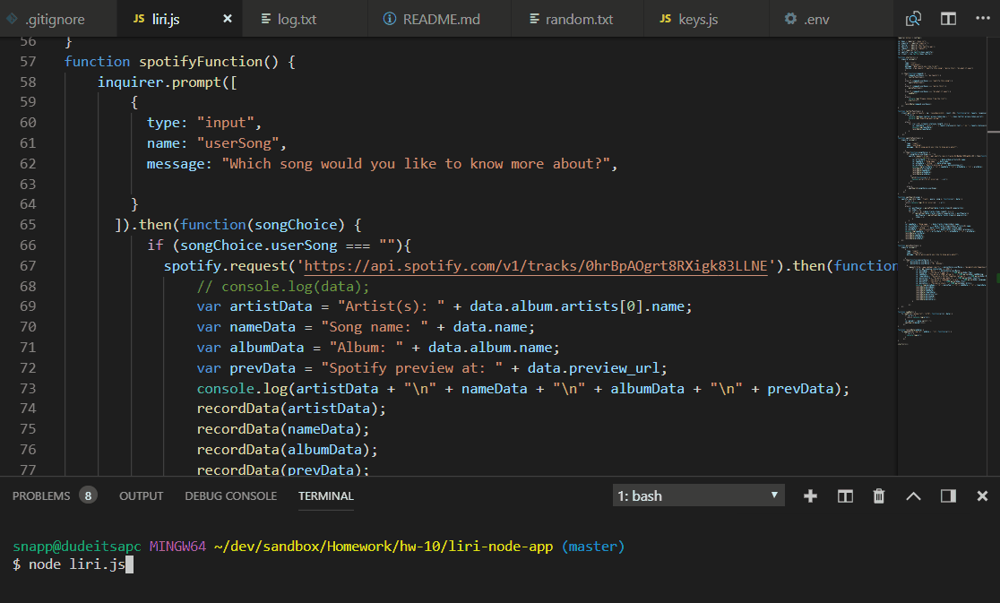
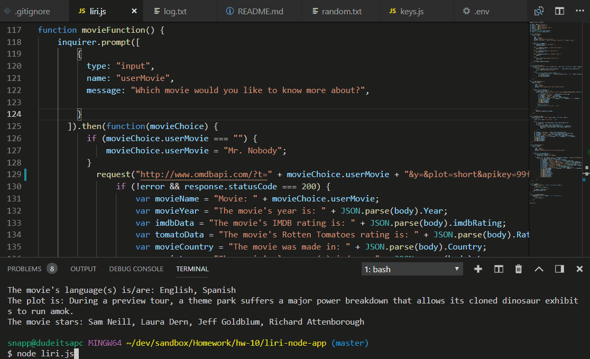
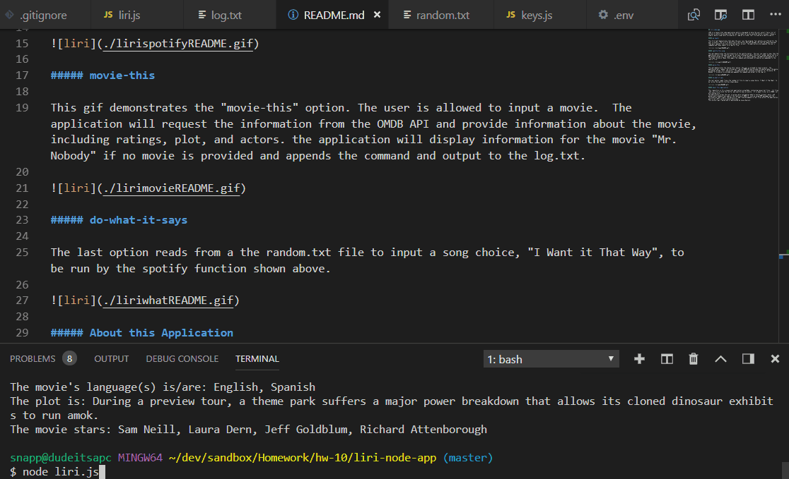

## liri-node-app

LIRI is a Javascritpt node application which is designed to help the user select from a list of options in which he/she may find the last 20 tweets of a pre-selected twitter account, choose a song or movie to get more information or read an in-folder text file and do a spotify search.

##### my-tweets

This first gif demonstrates that when the user runs the program, four options are offered for the user to select, the first of which calls the twitter API and uploads the last 20 tweets and when they were tweeted from a pre-selected twitter account. The application also appends the user's commands and these tweets to a log.txt file.

##### spotify-this-song

This gif demonstrates the functionality of the spotify option.  The user can input a song, then the application calls the spotify api to retrieve information about the artist, album, and a link to a 30-second preview for the song if there is one. If no song is given, the application defaults to "The Sign" by Ace of Base. Once again the command and displayed information are appended to the log.txt file.

##### movie-this

This gif demonstrates the "movie-this" option. The user is allowed to input a movie.  The application will request the information from the OMDB API and provide information about the movie, including ratings, plot, and actors. the application will display information for the movie "Mr. Nobody" if no movie is provided and appends the command and output to the log.txt.

##### do-what-it-says

The last option reads from a the random.txt file to input a song choice, "I Want it That Way", to be run by the spotify function shown above.

##### About this Application

This repository is for a Javascript application using Node, containing Javascript files, .txt files, and .env file to hold the twitter and spotify keys privately.  It is meant to be run in NODE, not on a hosted site.  
The application allows the user to access more information about a twitter account, music, and movies and to demonstrate some of the features of NODE JS, such as using NPM packages and the fuctionality they create, the ability to read from and append to text files within the application, and to call API's with privately-held keys. 
This project was created and is maintained by Jesse Hancock.